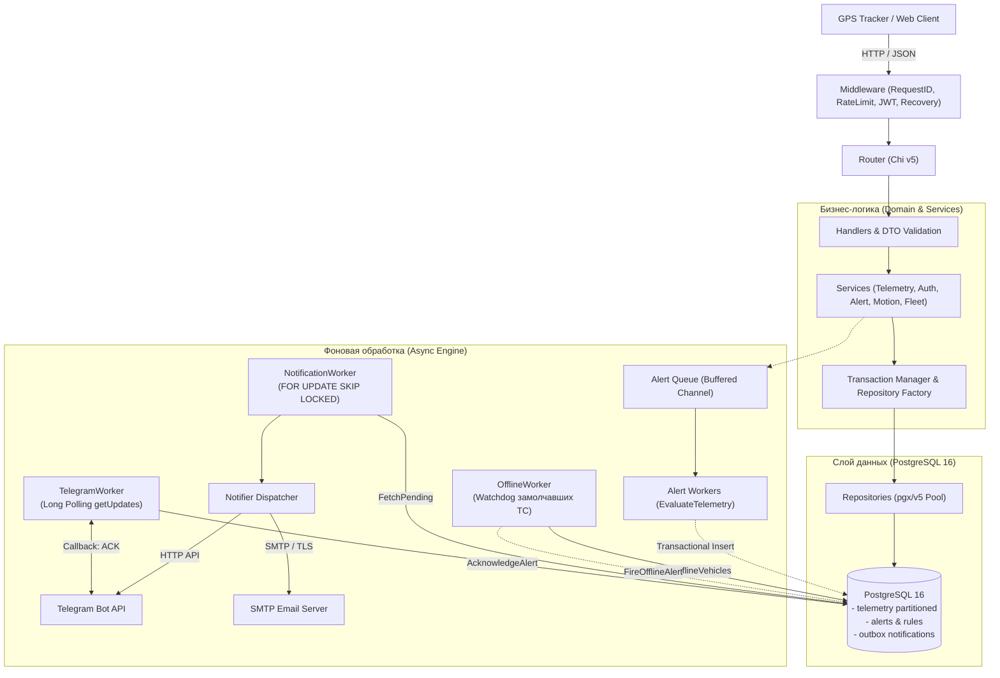

# FleetTrack

[](https://golang.org)
[](https://www.postgresql.org)
[](https://www.docker.com)
[](#архитектура)
[](https://github.com/Axiliyz/FleetTrack)

Бэкенд системы мониторинга и телематики автопарка. Сервис осуществляет приём и валидацию данных с GPS/ГЛОНАСС-терминалов, расчёт кинематических показателей в реальном времени, фиксацию нарушений по настраиваемым правилам и гарантированную доставку уведомлений в Telegram и Email с использованием паттерна Transactional Outbox.

---

## Содержание

- [Ключевые возможности](#ключевые-возможности)
- [Архитектура](#архитектура)
- [Стек технологий](#стек-технологий)
- [Структура проекта](#структура-проекта)
- [Быстрый старт](#быстрый-старт)
  - [Запуск через Docker Compose](#запуск-через-docker-compose-рекомендуется)
  - [Локальная разработка](#локальная-разработка)
  - [Конфигурация (.env)](#конфигурация-env)
- [Подсистема алертинга и нотификаций](#подсистема-алертинга-и-нотификаций)
  - [Stateful Alert Engine](#stateful-alert-engine)
  - [Детектор оффлайн-устройств (DEVICE_OFFLINE Watchdog)](#детектор-оффлайн-устройств-device_offline-watchdog)
  - [Интерактивная реакция диспетчера (ACKNOWLEDGED)](#интерактивная-реакция-диспетчера-acknowledged)
  - [Transactional Outbox и SKIP LOCKED](#transactional-outbox-и-skip-locked)
  - [Политика повторов (Exponential Backoff)](#политика-повторов-exponential-backoff)
- [Спецификация REST API](#спецификация-rest-api)
  - [Аутентификация и токены](#1-аутентификация-и-токены)
  - [Телеметрия](#2-телеметрия)
  - [Транспорт и трекеры](#3-транспорт-и-трекеры)
  - [Водители и рейсы](#4-водители-и-рейсы)
  - [Правила алертов](#5-правила-алертов)
- [Тестирование и качество кода](#тестирование-и-качество-кода)
- [Миграции базы данных](#миграции-базы-данных)

---

## Ключевые возможности

* **Сбор телеметрии под высокие нагрузки**: секционирование таблицы `telemetry` в PostgreSQL по диапазонам дат (`RANGE` по месяцам), оптимизированное для эффективной записи и выборки больших объёмов данных.
* **Кинематический анализ в реальном времени (`MotionService`)**: вычисление пройденного расстояния (формула гаверсинусов с учётом кривизны Земли), мгновенной скорости и накопление пробега в активном рейсе.
* **Stateful Alert Engine (`AlertService`)**: оценка телеметрии по настраиваемым правилам организации (`SPEED_EXCEEDED`, `LOW_FUEL`), предотвращение дубликатов открытых инцидентов и автоматический перевод в статус `RESOLVED` при нормализации метрик.
* **Watchdog оффлайн-устройств (`OfflineWorker`)**: регулярный фоновый мониторинг активных связей автомобилей и трекеров; выявление замолчавших устройств (`DEVICE_OFFLINE`) и автозакрытие инцидента при возобновлении связи.
* **Интерактивная обработка в Telegram (`TelegramWorker`)**: мгновенная отправка алертов с inline-кнопкой подтверждения, обработка callback-запросов через Long Polling и фиксация статуса `ACKNOWLEDGED`.
* **Гарантированная доставка (Transactional Outbox)**: фиксация алерта и формирование задач на отправку выполняются атомарно в единой транзакции БД.
* **Конкурентная обработка (`NotificationWorker`)**: безопасная многопоточная вычитка очереди без взаимных блокировок с использованием `FOR UPDATE OF n SKIP LOCKED`.
* **Мультиканальные уведомления**: отправка в Telegram Bot API и на Email через SMTP с маршрутизацией по минимальному уровню критичности (`min_severity`).
* **Мультитенантность и RBAC**: изоляция данных между организациями, ролевая модель доступа (`ADMIN`, `DISPATCHER`, `DRIVER`, `ANALYTIC`), JWT Access + Refresh токены с ротацией и защитой от перебора (Rate Limiting).

---

## Архитектура

Проект спроектирован по принципам Clean Architecture с разделением ответственности на независимые слои:



---

## Стек технологий

* **Язык**: [Go](https://golang.org/) `1.26.3`
* **HTTP-роутер**: [go-chi/chi/v5](https://github.com/go-chi/chi)
* **Работа с БД**: [jackc/pgx/v5](https://github.com/jackc/pgx) (нативный драйвер с поддержкой пула соединений `pgxpool` и транзакций)
* **Аутентификация**: [golang-jwt/jwt/v5](https://github.com/golang-jwt/jwt) (HS256 Access + Refresh токены)
* **База данных**: [PostgreSQL 16](https://www.postgresql.org/) (партиционирование по диапазонам, частичные индексы, `SKIP LOCKED`)
* **Миграции**: [golang-migrate/migrate](https://github.com/golang-migrate/migrate)
* **Контейнеризация**: Docker & Docker Compose

---

## Структура проекта

```text
fleettrack/
├── cmd/
│   └── api/                  # Точка входа в приложение (main.go)
├── internal/
│   ├── app/                  # Инициализация зависимостей, запуск и graceful shutdown
│   ├── config/               # Загрузка и валидация конфигурации из переменных окружения
│   ├── database/             # Интерфейсы работы с БД (DBTX, pgxpool)
│   ├── handler/              # HTTP-хэндлеры, маршрутизация ответов и маппинг ошибок
│   │   └── dto/              # Data Transfer Objects (DTO запросов и ответов)
│   ├── logger/               # Структурированное логирование с поддержкой уровней
│   ├── middleware/           # HTTP Middleware (Auth, RateLimiter, RequestID, Recovery, RoleCheck)
│   ├── model/                # Доменные модели приложения и типизированные ошибки
│   ├── notifier/             # Отправители уведомлений (Dispatcher, TelegramSender, EmailSender)
│   ├── repository/           # Интерфейсы репозиториев
│   │   ├── factory/          # Фабрика репозиториев для атомарных транзакций
│   │   └── postgres/         # Реализация репозиториев для PostgreSQL на pgx/v5
│   ├── router/               # Сборка Chi-роутера и подключение роутов
│   ├── service/              # Бизнес-логика (Telemetry, Motion, Alert, Auth, Trips и др.)
│   ├── transaction/          # Менеджер транзакций (WithTx)
│   ├── validator/            # Валидаторы параметров
│   └── worker/               # Фоновые воркеры (NotificationWorker, TelegramWorker, OfflineWorker)
├── migrations/               # SQL-миграции базы данных (Up / Down)
├── diagrams/                 # Архитектурные диаграммы и схемы БД
├── docker-compose.yml        # Оркестрация контейнеров (API, PostgreSQL, Migrations)
├── Dockerfile                # Многоэтапная сборка (Multi-stage build) минимального образа
├── Makefile                  # Набор команд для сборки, тестирования и миграций
└── README.md                 # Документация проекта
```

---

## Быстрый старт

### Запуск через Docker Compose (рекомендуется)

Все компоненты (PostgreSQL, миграции и API) запускаются одной командой:

```bash
# 1. Склонируйте репозиторий
git clone https://github.com/Axiliyz/FleetTrack.git
cd FleetTrack

# 2. Создайте файл конфигурации окружения
cp .env.example .env

# 3. Запустите инфраструктуру
docker compose up --build -d

# 4. Проверьте логи сервиса
docker compose logs -f api
```

После старта:
* **API** доступен по адресу: `http://localhost:8080`
* **PostgreSQL** доступен на хосте по порту `5433` (внутри контейнера `5432`)

---

### Локальная разработка

Для запуска бэкенда на локальной машине:

```bash
# 1. Запустите базу данных и примените миграции
docker compose up postgres fleettrack-postgres-migrate -d

# 2. Установите Go-зависимости
go mod download

# 3. Запустите сервер
make run
# либо: go run ./cmd/api
```

---

### Конфигурация (.env)

Все параметры конфигурируются через переменные окружения:

| Переменная | По умолчанию | Описание |
| :--- | :--- | :--- |
| `APP_NAME` | `fleettrack` | Имя приложения |
| `API_PORT` | `8080` | Порт HTTP-сервера |
| `DB_USER` | `postgres` | Пользователь PostgreSQL |
| `DB_PASSWORD` | `postgres` | Пароль базы данных |
| `DB_NAME` | `fleettrack` | Имя базы данных |
| `DB_PORT` | `5433` | Внешний порт PostgreSQL |
| `JWT_SECRET` | `super-secret-key` | Секретный ключ подписи JWT-токенов |
| `JWT_ACCESS_TTL` | `15m` | Время жизни access-токена |
| `JWT_REFRESH_TTL` | `168h` | Время жизни refresh-токена (7 дней) |
| `TELEGRAM_BOT_TOKEN` | — | Токен Telegram-бота от BotFather |
| `SMTP_HOST` | `smtp.gmail.com` | Адрес SMTP-сервера |
| `SMTP_PORT` | `587` | Порт SMTP-сервера (TLS) |
| `SMTP_USERNAME` | — | Логин SMTP / почтовый ящик |
| `SMTP_PASSWORD` | — | Пароль приложения (App Password) |
| `SMTP_FROM` | — | Email-адрес отправителя |

---

## Подсистема алертинга и нотификаций

### Stateful Alert Engine
При поступлении точки телеметрии сервис `AlertService`:
1. Находит активные правила для организации (`SPEED_EXCEEDED`, `LOW_FUEL`)
2. Проверяет наличие открытого алерта по автомобилю и правилу через частичный уникальный индекс:
   ```sql
   CREATE UNIQUE INDEX idx_alerts_active_unique 
   ON alerts (vehicle_id, rule_id) 
   WHERE status != 'RESOLVED';
   ```
3. Если условие выполнено и открытого алерта нет — создается новый алерт со статусом `FIRED`
4. Если телеметрия вернулась в норму, а алерт открыт — статус автоматически переводится в `RESOLVED`

### Детектор оффлайн-устройств (DEVICE_OFFLINE Watchdog)
Для контроля работоспособности оборудования запущен фоновый воркер `OfflineWorker`:
1. Периодически (раз в 30 секунд) запрашивает активные правила с типом `DEVICE_OFFLINE`
2. По каждому правилу выполняет аналитический запрос к базе данных, проверяя все действующие привязки трекеров (`ended_at IS NULL`):
   ```sql
   SELECT v.id, v.organization_id, da.device_id,
          COALESCE(MAX(t.received_at), da.started_at) AS last_seen,
          EXTRACT(EPOCH FROM (NOW() - COALESCE(MAX(t.received_at), da.started_at))) / 60 AS minutes_offline
   FROM device_assignments da
   JOIN vehicles v ON v.id = da.vehicle_id
   LEFT JOIN telemetry t ON t.vehicle_id = v.id
   WHERE da.ended_at IS NULL
   GROUP BY v.id, v.organization_id, da.device_id, da.started_at
   HAVING EXTRACT(EPOCH FROM (NOW() - COALESCE(MAX(t.received_at), da.started_at))) / 60 >= $1;
   ```
3. Если устройство молчит дольше заданного порога, и по автомобилю нет открытого инцидента — генерируется алерт `FIRED` с сообщением о времени отсутствия связи
4. Как только от транспортного средства приходит свежая точка телеметрии, сервис `AlertService` автоматически переводит алерт `DEVICE_OFFLINE` в статус `RESOLVED`

### Интерактивная реакция диспетчера (ACKNOWLEDGED)
Для оперативного реагирования на инциденты реализован двухсторонний протокол взаимодействия через Telegram:
1. При генерации алерта в Telegram отправляется сообщение с интерактивной inline-кнопкой `[ Принять в работу ]` (callback_data: `ack:<alert_id>`)
2. Фоновый воркер `TelegramWorker` по протоколу Long Polling (`getUpdates?timeout=25`) непрерывно слушает события от Telegram Bot API
3. При нажатии кнопки диспетчером:
   * Вызывается метод `AcknowledgeAlert`, переводящий статус инцидента из `FIRED` в `ACKNOWLEDGED` с фиксацией времени реакции (`acknowledged_at`) и идентификатора сотрудника (`acknowledged_by`)
   * Через метод Telegram API `answerCallbackQuery` диспетчер получает мгновенное всплывающее уведомление о принятии задачи
   * Через метод `editMessageReplyMarkup` текст кнопки в исходном сообщении изменяется на `[ В работе ]`, предотвращая повторные нажатия другими операторами

### Transactional Outbox и SKIP LOCKED
Для исключения рассинхронизации базы данных и внешних каналов доставки алерт и задачи нотификаций создаются в единой транзакции:

1. Задачи сохраняются в таблицу `alert_notifications` со статусом `PENDING`
2. Фоновый воркер `NotificationWorker` с таймером (каждые 2 секунды) считывает пачку задач с помощью неблокирующего захвата строк:
   ```sql
   SELECT ... FROM alert_notifications n
   JOIN user_notification_channels c ON c.id = n.channel_id
   JOIN alerts a ON a.id = n.alert_id
   WHERE n.status = 'PENDING'
     AND (n.next_retry_at IS NULL OR n.next_retry_at <= NOW())
   ORDER BY n.id ASC
   LIMIT $1
   FOR UPDATE OF n SKIP LOCKED;
   ```
   > Примечание: Механизм `SKIP LOCKED` исключает взаимные блокировки и позволяет горизонтально масштабировать воркеры на несколько инстансов приложения.

### Политика повторов (Exponential Backoff)
При возникновении сбоя сети (таймаут соединения, недоступность шлюза):
* Воркер увеличивает счетчик `attempts`
* Рассчитывает время следующей попытки `next_retry_at`:
  * **0-я ошибка**: повтор через 10 секунд
  * **1-я ошибка**: повтор через 30 секунд
  * **2-я ошибка**: повтор через 1 минуту
  * **3-я ошибка**: статус переводится в `FAILED` (исчерпание лимита попыток)

---

## Спецификация REST API

Все защищенные эндпоинты требуют заголовок `Authorization: Bearer <access_token>`.

### 1. Аутентификация и токены

| Метод | Эндпоинт | Роли | Описание |
| :--- | :--- | :--- | :--- |
| `POST` | `/register` | Public | Регистрация новой организации и первичного администратора |
| `POST` | `/login` | Public | Вход в систему (получение `access_token` и `refresh_token`) |
| `POST` | `/refresh` | Public | Ротация пары токенов по валидному refresh-токену |
| `POST` | `/logout` | Public | Отзыв текущей сессии refresh-токена |

#### Пример авторизации (`POST /login`):
```bash
curl -X POST http://localhost:8080/login \
  -H "Content-Type: application/json" \
  -d '{
    "email": "admin@example.com",
    "password": "Password123"
  }'
```

---

### 2. Телеметрия

| Метод | Эндпоинт | Роли | Описание |
| :--- | :--- | :--- | :--- |
| `POST` | `/telemetry` | Any Auth | Приём телеметрии от GPS-трекера |
| `GET` | `/telemetry` | Any Auth | Получение списка телеметрии с фильтрами |
| `GET` | `/telemetry/{id}` | Any Auth | Получение конкретной точки по ID |
| `GET` | `/telemetry/vehicles/{id}` | Any Auth | Вся телеметрия по автомобилю |
| `DELETE` | `/telemetry/{id}` | ADMIN, DISPATCHER | Удаление записи телеметрии |
| `DELETE` | `/telemetry/vehicles/{id}` | ADMIN, DISPATCHER | Удаление всей телеметрии автомобиля |

#### Пример отправки телеметрии (`POST /telemetry`):
```bash
curl -X POST http://localhost:8080/telemetry \
  -H "Authorization: Bearer <TOKEN>" \
  -H "Content-Type: application/json" \
  -d '{
    "device_id": 1,
    "vehicle_id": 3,
    "lat": 55.7558,
    "lon": 37.6173,
    "fuel": 68.5
  }'
```

**Ответ (200 OK):**
```json
{
  "status": "success",
  "message": "Telemetry got to post",
  "request_id": "8b0fdca9-1234-4a56-b789-0123456789ab",
  "data": {
    "telemetry_id": 105,
    "vehicle_id": 3,
    "device_id": 1,
    "received_at": "2026-09-14T14:00:00Z",
    "trip_id": 1,
    "distance_km": 1.25,
    "speed_kmh": 62.4
  }
}
```

---

### 3. Транспорт и трекеры

| Метод | Эндпоинт | Роли | Описание |
| :--- | :--- | :--- | :--- |
| `GET` | `/vehicles` | Any Auth | Список автомобилей организации |
| `POST` | `/vehicles` | ADMIN, DISPATCHER | Добавление нового ТС |
| `GET` | `/vehicles/{id}` | Any Auth | Данные ТС по ID |
| `PATCH` | `/vehicles/{id}` | ADMIN, DISPATCHER | Обновление параметров ТС |
| `DELETE` | `/vehicles/{id}` | ADMIN, DISPATCHER | Удаление ТС |
| `POST` | `/devices` | ADMIN, DISPATCHER | Регистрация нового GPS-терминала |
| `GET` | `/devices/{id}` | Any Auth | Информация о трекере |
| `POST` | `/assignments` | ADMIN, DISPATCHER | Привязка трекера к автомобилю |

---

### 4. Водители и рейсы

| Метод | Эндпоинт | Роли | Описание |
| :--- | :--- | :--- | :--- |
| `GET` | `/drivers` | Any Auth | Список водителей |
| `POST` | `/drivers` | ADMIN, DISPATCHER | Создание профиля водителя |
| `GET` | `/trips` | Any Auth | Список рейсов с фильтрацией |
| `POST` | `/trips` | ADMIN, DISPATCHER | Открытие и назначение нового рейса |
| `PATCH` | `/trips/{id}` | ADMIN, DISPATCHER | Обновление статуса рейса (`COMPLETED`, `CANCELLED`) |

---

### 5. Правила алертов

| Метод | Эндпоинт | Роли | Описание |
| :--- | :--- | :--- | :--- |
| `GET` | `/alert-rules` | Any Auth | Список настроенных правил алертов |
| `GET` | `/alert-rules/{id}` | Any Auth | Правило алертов по ID |
| `POST` | `/alert-rules` | ADMIN, DISPATCHER | Создание нового правила |
| `DELETE` | `/alert-rules/{id}` | ADMIN, DISPATCHER | Удаление правила |

#### Пример создания правила (`POST /alert-rules`):
```bash
curl -X POST http://localhost:8080/alert-rules \
  -H "Authorization: Bearer <TOKEN>" \
  -H "Content-Type: application/json" \
  -d '{
    "type": "SPEED_EXCEEDED",
    "name": "Превышение скорости 90 км/ч",
    "threshold": 90.0,
    "severity": "HIGH",
    "enabled": true
  }'
```

---

## Тестирование и качество кода

В репозитории реализовано покрытие модульными тестами ключевых слоёв (сервисы, хэндлеры, репозитории, middleware, воркеры, нотификаторы).

### Статический анализ и форматирование

```bash
# Проверка go vet
make vet

# Форматирование исходного кода
make fmt

# Запуск линтера (golangci-lint)
make lint
```

---

## Миграции базы данных

Управление схемой БД осуществляется через утилиту `golang-migrate`:

```bash
# Применить все миграции вверх
make migrate-up

# Откатить последнюю миграцию
make migrate-action action="down 1"

# Создать новую миграцию
make migrate-create seq=add_custom_field
```

---

## Лицензия

Проект распространяется под лицензией MIT.